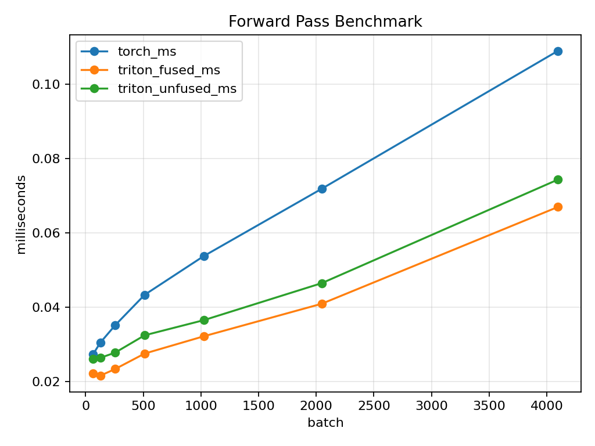
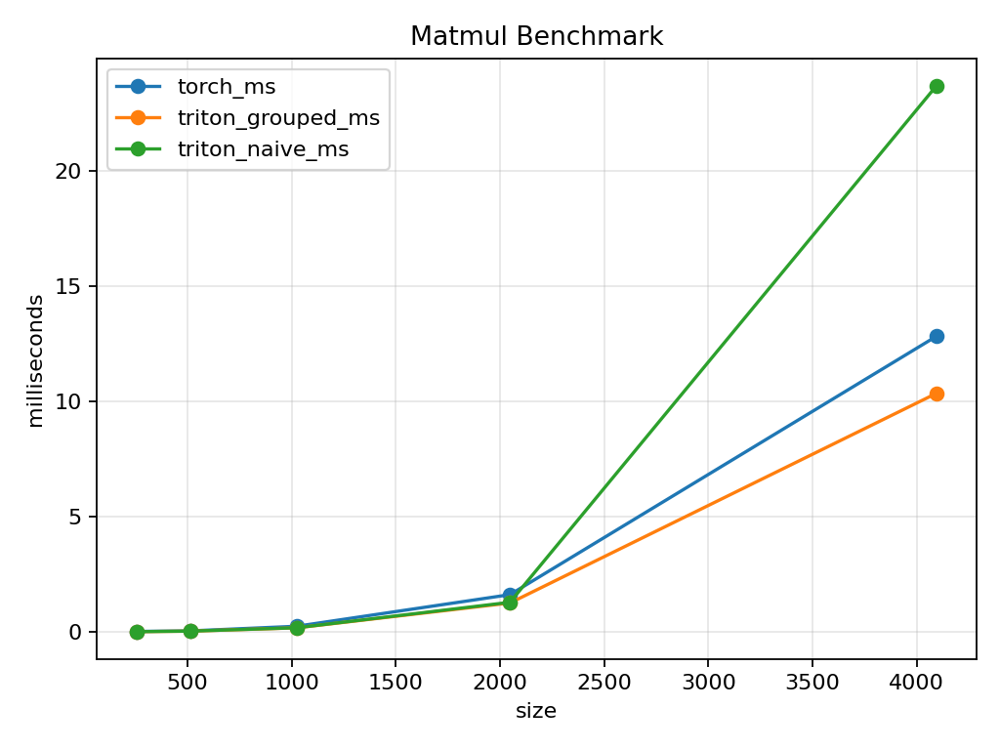
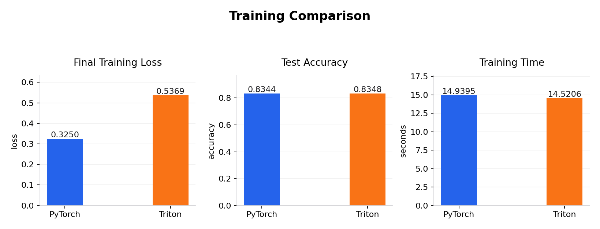

# Softmax Regression with Triton: Operator Fusion and Cache-Aware Scheduling

## 1. Introduction

Modern deep learning frameworks like PyTorch hide GPU memory traffic behind high-level APIs such as `F.cross_entropy` and autograd. This project peels back that abstraction by implementing softmax regression entirely in Triton, a Python-based GPU kernel language. The goal is not to outperform PyTorch's highly optimized CUDA libraries, but to make two systems-level optimizations explicit and measurable:

1. **Operator fusion** --- combining softmax and cross-entropy into a single GPU kernel to eliminate redundant memory round-trips.
2. **Cache-aware program scheduling** --- reordering matrix multiplication tile assignments so that nearby programs share data in the L2 cache.

The model is deliberately minimal: a single linear layer trained on FashionMNIST (784 input features, 10 output classes). This keeps the mathematical complexity low and lets the report focus on kernel design and memory behavior.

**Environment.** All experiments were run on an NVIDIA GeForce RTX 5060 Laptop GPU with PyTorch 2.8.0+cu128 and Triton 3.4.0.

## 2. Project Structure

```
softmax_regression.py         CLI entry point (smoke / validate / train / bench)
smreg/
  triton_ops.py               Triton kernels and Python wrapper functions
  model.py                    PyTorch nn.Module baseline (nn.Linear)
  train.py                    Training loops for both implementations
  bench.py                    Correctness checks, benchmarks, plotting
  data.py                     FashionMNIST loading with flattened 784-dim vectors
  config.py                   Constants (INPUT_DIM=784, NUM_CLASSES=10)
```

The Triton implementation expresses the full training loop as explicit kernel calls:

```
Forward:
  O      = triton_matmul(X, W)               # tiled matmul with L2 grouping
  O      = triton_bias_add(O, b)             # broadcast add
  loss, Y_hat = triton_fused_softmax_ce(O, labels)   # fused kernel

Backward:
  dO = (Y_hat - one_hot(labels)) / batch_size        # elementwise
  dW = triton_matmul(X^T, dO)               # reuses the same matmul kernel
  db = triton_row_sum(dO)                    # column-wise reduction
  W -= lr * dW;   b -= lr * db              # SGD update
```

The PyTorch baseline compresses all of this into `F.cross_entropy(model(x), y)` followed by `loss.backward()` and `optimizer.step()`.

## 3. Kernel Design: Fused Softmax + Cross-Entropy

### 3.1 The Memory Problem with Separate Kernels

Consider the naive (unfused) approach for computing cross-entropy loss from logits:

**Kernel 1 --- Softmax.** Read the logits matrix O (n x 10) from DRAM, compute row-wise softmax, write the full probability matrix P (n x 10) back to DRAM.

**Kernel 2 --- Cross-Entropy.** Read the probability matrix P (n x 10) back from DRAM, select the correct-class probability for each row, compute -log(p), write the loss vector (n x 1).

The intermediate probability matrix P takes a full round-trip through DRAM --- written by kernel 1 and immediately re-read by kernel 2. For a batch of n samples with q classes, this costs an extra 2nq memory transactions (nq writes + nq reads) that serve no purpose other than passing data between two kernels.

```
Unfused data flow:

  DRAM  ──read O──>  [Softmax kernel]  ──write P──>  DRAM
  DRAM  ──read P──>  [CrossEnt kernel] ──write loss──> DRAM
         ^^^^^^^^                        ^^^^^^^^
         nq reads                        nq reads
                     nq writes ──────────┘ (wasted round-trip)
```

### 3.2 The Fused Solution

The fused kernel (`fused_softmax_crossentropy_kernel`) assigns one Triton program per row. Each program:

1. Loads one row of logits from DRAM into registers.
2. Computes softmax entirely on-chip: subtract max, exponentiate, sum, divide.
3. Selects the correct-class probability using the label.
4. Computes -log(p) and writes the scalar loss.
5. Writes the probability row (needed by the backward pass).

```
Fused data flow:

  DRAM  ──read O──>  [Fused kernel: softmax + CE on-chip]
                          │                    │
                     write P to DRAM      write loss to DRAM
```

The logits are read once. The softmax intermediate values (shifted logits, exponentials, denominator) never leave registers. The probability matrix is written once (for the backward pass), not written and then re-read. This eliminates nq memory transactions per batch.

### 3.3 Key Implementation Details

The kernel pads each row to a power-of-two block size and masks invalid columns:

```python
cols = tl.arange(0, BLOCK_SIZE)
mask = cols < n_cols
logits = tl.load(logits_ptr + row * n_cols + cols, mask=mask, other=-float("inf"))
```

Masked positions are loaded as -inf, which is the identity element for max and produces zero after exponentiation, so they do not affect the softmax result. The numerical stabilization (subtracting the row maximum before exponentiation) is critical for avoiding overflow in exp() and is performed on-chip at zero extra memory cost.

To extract the correct-class probability without scalar indexing (which Triton does not support inside a vectorized row), the kernel uses a broadcast comparison:

```python
correct_prob = tl.sum(tl.where(cols == label, probs, 0.0), axis=0)
```

This zeros out all classes except the correct one, then reduces to a scalar.

### 3.4 Forward Pass Benchmark

The forward benchmark measures the full forward path (matmul + bias add + loss computation) at varying batch sizes:

| Batch | PyTorch (ms) | Triton Fused (ms) | Triton Unfused (ms) | Fused Speedup vs Unfused |
|------:|-------------:|-------------------:|--------------------:|-------------------------:|
|    64 |       0.0273 |             0.0223 |              0.0260 |                    14.2% |
|   128 |       0.0305 |             0.0216 |              0.0264 |                    18.2% |
|   256 |       0.0351 |             0.0234 |              0.0278 |                    15.8% |
|   512 |       0.0433 |             0.0275 |              0.0324 |                    15.1% |
|  1024 |       0.0537 |             0.0322 |              0.0365 |                    11.8% |
|  2048 |       0.0718 |             0.0409 |              0.0465 |                    12.0% |
|  4096 |       0.1089 |             0.0669 |              0.0743 |                    10.0% |

The fused kernel is consistently 10--18% faster than the unfused variant. The absolute savings are small (microseconds) because FashionMNIST has only 10 classes --- the intermediate probability matrix is tiny. In production models with vocabulary sizes of 30,000+ (language models) or 1,000+ (ImageNet), the eliminated round-trip would save megabytes of bandwidth per batch.

The fused Triton path is also faster than PyTorch's `F.cross_entropy` at all batch sizes. This is partly because PyTorch's implementation is general-purpose (supporting label smoothing, weight vectors, ignore indices), while the Triton kernel is specialized for the exact computation needed.



## 4. Kernel Design: Matrix Multiplication with L2 Cache Grouping

### 4.1 The Tiled Matmul Algorithm

The matmul kernel computes C = A x B by tiling the output into blocks of size (BLOCK_SIZE_M x BLOCK_SIZE_N). Each Triton program computes one output tile by iterating over the K dimension in chunks of BLOCK_SIZE_K:

```
acc = zeros([BLOCK_SIZE_M, BLOCK_SIZE_N])
for k in range(0, ceil(K / BLOCK_SIZE_K)):
    a_tile = A[m_block, k_chunk]       # load from DRAM
    b_tile = B[k_chunk, n_block]       # load from DRAM
    acc += dot(a_tile, b_tile)         # FMA in registers
C[m_block, n_block] = acc              # write once
```

This approach reads each element of A and B multiple times across different programs (every program in the same block-row of C reads the same A rows; every program in the same block-column reads the same B columns). The L2 cache is the hardware mechanism that avoids redundant DRAM fetches --- but only if programs that share data execute close together in time.

### 4.2 Why Program Order Matters

Programs are launched as a flat 1D array (`pid = 0, 1, 2, ...`). The hardware dispatches them to streaming multiprocessors (SMs) roughly in order, so nearby pids tend to run concurrently. The question is: how should the flat pid map to the 2D output tile grid?

**Naive row-major ordering:**

```python
pid_m = pid // num_pid_n     # block-row
pid_n = pid % num_pid_n      # block-column
```

Programs sweep left-to-right across an entire row of output tiles before moving down. For a 9x9 tile grid, programs 0--8 all compute row 0. They all share the same A rows (good), but each needs a different B column-strip (9 different strips loaded into L2). When programs 9--17 start row 1, they need the same 9 B column-strips --- but those may already be evicted from L2 by other data. Result: B is re-read from DRAM for every row.

**Grouped column-major ordering:**

```python
num_pid_in_group = GROUP_SIZE_M * num_pid_n
group_id = pid // num_pid_in_group
first_pid_m = group_id * GROUP_SIZE_M
group_size_m = min(num_pid_m - first_pid_m, GROUP_SIZE_M)
pid_m = first_pid_m + ((pid % num_pid_in_group) % group_size_m)
pid_n = (pid % num_pid_in_group) // group_size_m
```

This divides the output grid into horizontal bands of GROUP_SIZE_M rows. Within each band, programs are ordered column-major: they iterate down the rows before moving to the next column. Consecutive pids (e.g., pid 0, 1, 2 with GROUP_SIZE_M=3) all compute the same column of output tiles, meaning they all need the same B column-strip. Since they run near-simultaneously, the first program loads that B strip into L2, and the next two find it already cached.

```
Naive (row-major):                Grouped (column-major within bands):

 col0  col1  col2  col3           col0  col1  col2  col3
[ 0    1     2     3  ]          [ 0    3     6     9  ]   GROUP 0
[ 4    5     6     7  ]          [ 1    4     7    10  ]   (3 rows)
[ 8    9    10    11  ]          [ 2    5     8    11  ]
[12   13    14    15  ]          [12   15    18    21  ]   GROUP 1
 ...                              ...
```

In the grouped layout, pids 0/1/2 share B column 0; pids 3/4/5 share B column 1. Each B column-strip is loaded from DRAM once and reused GROUP_SIZE_M times from L2 cache.

### 4.3 Matmul Benchmark

The kernel includes a compile-time `GROUPED` flag (a `tl.constexpr`) that switches between the two orderings with no runtime cost. The benchmark tests both on square matrices of increasing size:

| Size | PyTorch (ms) | Triton Grouped (ms) | Triton Naive (ms) | Grouped vs Naive |
|-----:|-------------:|---------------------:|------------------:|-----------------:|
|  256 |       0.0204 |               0.0113 |            0.0111 |           ~same  |
|  512 |       0.0433 |               0.0323 |            0.0326 |           ~same  |
| 1024 |       0.2448 |               0.1764 |            0.1784 |            1.1%  |
| 2048 |       1.6161 |               1.2539 |            1.2847 |            2.4%  |
| 4096 |      12.8260 |              10.3501 |           23.6936 |         **56.3%**|

At small sizes (256--1024), the entire working set fits in L2 cache regardless of program order, so both orderings perform identically. At 4096x4096, the matrices exceed L2 capacity, and naive ordering causes severe cache thrashing: 23.7 ms vs 10.4 ms for grouped ordering --- a 2.3x slowdown. The grouped Triton kernel also outperforms PyTorch's cuBLAS at this size (10.4 ms vs 12.8 ms), though cuBLAS uses different internal heuristics and is optimized for a broader range of shapes.



The sharp performance cliff between 2048 and 4096 for naive ordering is characteristic of cache capacity effects. When the working set exceeds L2 size, every tile load becomes a DRAM fetch, and the cubic scaling of matmul amplifies the penalty.

## 5. Training Correctness and Results

### 5.1 Correctness Validation

Before benchmarking, the Triton kernels are validated against PyTorch autograd. The `validate` mode generates random inputs, runs both forward and backward passes, and checks that logits, loss, weight gradient dW, and bias gradient db match within tolerance (atol=1e-3):

```
Forward and backward correctness checks passed.
```

### 5.2 End-to-End Training

Both implementations train on the full FashionMNIST dataset (60,000 images, 10 epochs, batch size 256, learning rate 0.1) with identical initialization (W ~ N(0, 0.01), b = 0):

| Implementation | Final Training Loss | Test Accuracy | Training Time (s) |
|:--------------:|--------------------:|--------------:|-------------------:|
|    PyTorch     |              0.3250 |        83.44% |             14.94  |
|    Triton      |              0.5369 |        83.48% |             14.52  |

Both reach approximately 83.5% test accuracy, confirming that the Triton training loop computes correct gradients. The final mini-batch training losses differ (0.33 vs 0.54) because this metric captures only the last mini-batch --- it depends on which specific samples appear last and is not meaningful for comparison. The test accuracy, evaluated over the full test set, is the reliable metric and is nearly identical.



## 6. Conclusion

This project demonstrates two fundamental GPU performance principles through a minimal but complete example:

1. **Operator fusion eliminates redundant memory traffic.** The fused softmax + cross-entropy kernel avoids writing and re-reading the intermediate probability matrix, achieving 10--18% speedup over the unfused variant. The benefit is proportional to the size of the eliminated intermediate --- small for 10 classes, substantial for larger output vocabularies.

2. **Program scheduling controls cache behavior.** The grouped matmul ordering ensures that programs sharing B-matrix columns run concurrently, keeping shared data in L2 cache. At 4096x4096, this yields a 2.3x speedup over naive row-major ordering. The effect is absent at small sizes where the working set fits in cache regardless.

These are the same optimizations that production GPU libraries (cuBLAS, cuDNN, FlashAttention) employ internally. Triton makes them accessible at the Python level, providing both a practical tool for writing custom kernels and an educational platform for understanding the memory hierarchy that governs GPU performance.
